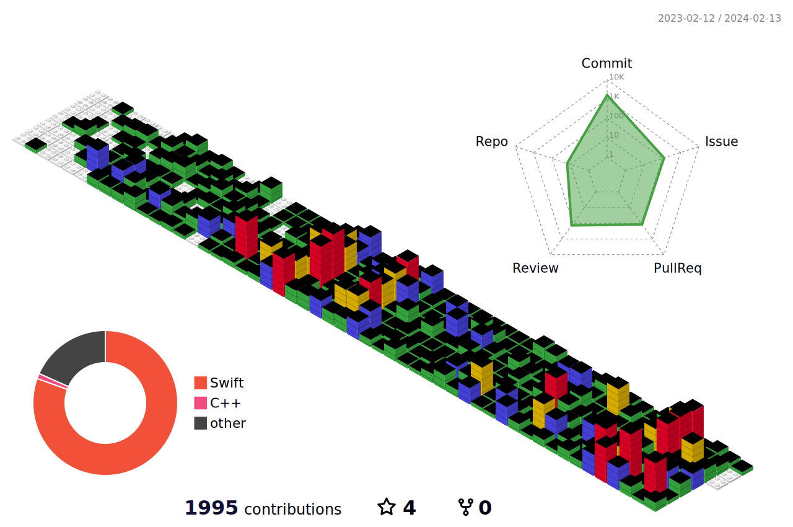

# Hello, I am Zoe 👋 #
**도전🚀 몰입🔥 실행🙆‍♀️** 
근거에 대해 끊임없이 고민하고 새로운 기술에 대한 호기심으로 성장하는 iOS 개발자 이지희입니다.  
유저에 대한 이해를 바탕으로 개발의 가치를 실현하는 `Problem Solver`를 꿈꾸고 있습니다

### School 🏫
Soongsil Univ. GlobalMedia
## Activity 🌊🏄‍♂️
### **Yourssu** 
 Contents Designer (2020.3 ~ 2022.3)  
 iOS developer (2022.3 ~)

### **GO SOPT** 
 iOS part YB (2023.3 ~ 7)  
**YELL:O** iOS developer (DEMODAY 대상)

### MIND23 
SOPT 15주년 컨퍼런스 
**MIND23 : 오늘도 멈추지 않는 IT인들** Marketer

### **DO SOPT** 
 iOS part OB (2023.9 ~ 2024.1)  
 33기 운영팀 **꿈결티미단** 온라인 디자인  
**HMH (하면함)** iOS Lead (DEMODAY 우수상)
 

 
### OverView 👀

**welcome** 🥳 

## iOS Engineering👩‍💻 ##
### 🔥tech stack🔥 ###

### 🛠️tools🛠️ ###

 

### EnZoe With Me 🙆‍♀️ 
#### 📬 email : mam07065@naver.com
#### 📸 instagram : @9.ysaeee29
#### ✅ velog : https://velog.io/@mam07065

